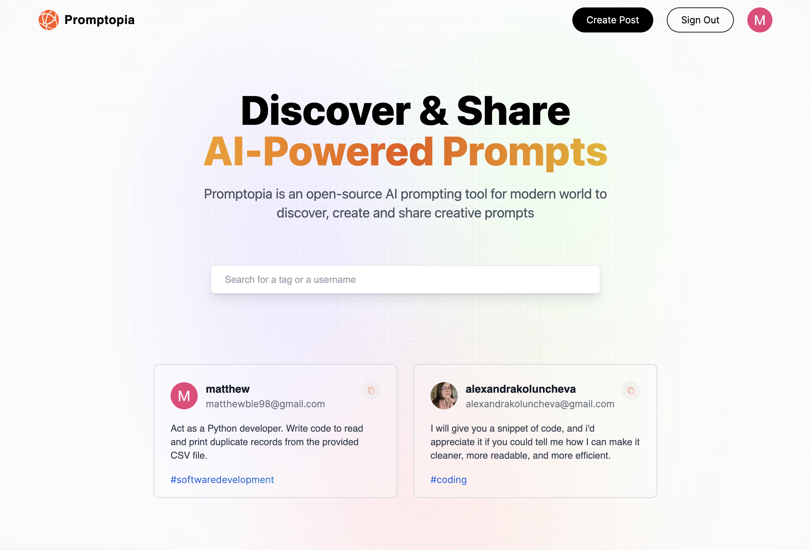
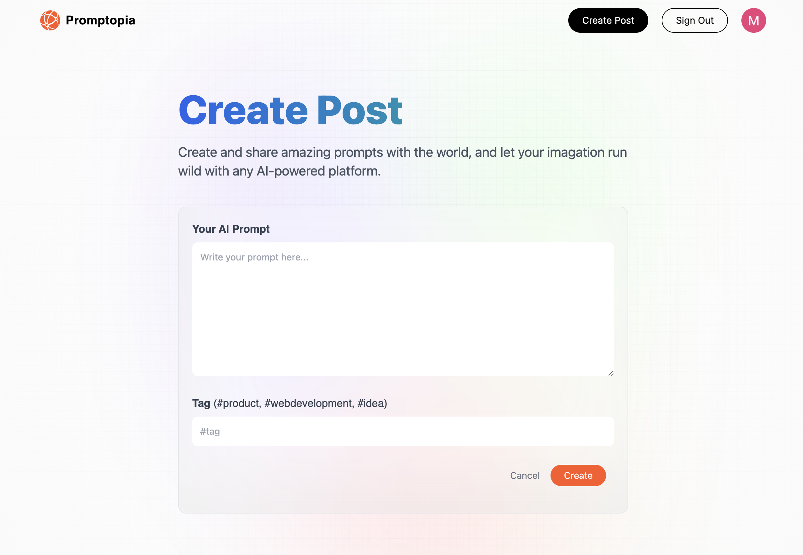
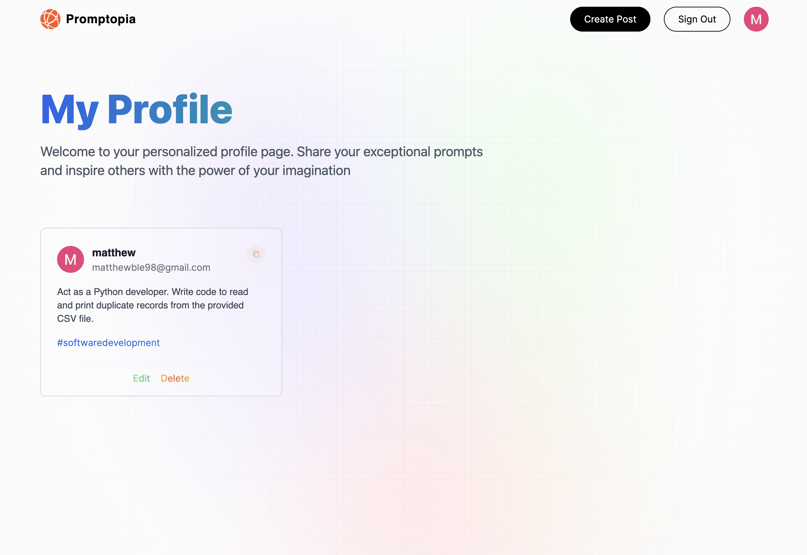

This is a [Next.js](https://nextjs.org/) tutorial project that I followed from JavaScript Mastery's <a href="https://www.youtube.com/@javascriptmastery">Youtube channel</a>. The application allows users to easily discover and share Ai prompts.

Vercel example site: https://nextjs-tutorial-application.vercel.app/

## Getting Started

Add the environment variables inside a .env.local file in the root directory. The application requires Google OAuth 2.0, MongoDB Atlas Cluster and NextAuth.js environment variables.

```
GOOGLE_ID=[]
GOOGLE_CLIENT_SECRET=[]
MONGODB_URI=[]

NEXTAUTH_URL=http://localhost:3000
NEXTAUTH_URL_INTERNAL=http://localhost:3000
NEXTAUTH_SECRET=
```

The NEXTAUTH_SECRET variable can be created with:

```
openssl rand -base64 32
```

Run the development server:

```bash
npm run dev
# or
yarn dev
# or
pnpm dev
```

## Screenshots




